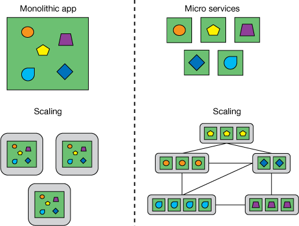

# Mikroservis Nedir?

 Tek başına, tek sorumluluğu olan ve tek iş yapan sadece o işe ait işleri yürüten modüler projelerdir.Monolitik mimariler başlığında belirtilen sorunlardan kurtulmanın bir yolu mikroservis mimarisine geçmektir. Mikroservis, tanımı gereği küçük,geliştirilmesi ortalama iki üç hafta süren, bağımsız (otonom), diğer mikroservislerle sıkı sıkıya bağımlılığı bulunmayan, tek başına çalışan, kendine ait veritabanı olan, geliştirme sürecinden kuruluma kadar bağımsız olan,yatayda ve dikeyde kendi başına ölçeklenebilen uygulamalardır.
 
* Mikroservis mimarisi, bir uygulamayı küçük, bağımsız ve gevşek bağlı servislerin bir koleksiyonu olarak yapılandıran bir yazılım geliştirme yaklaşımıdır.
* Her mikroservis belirli bir işlevselliğe odaklanır ve diğer mikroservislerden bağımsız olarak geliştirilebilir, dağıtılabilir ve ölçeklendirilebilir.
* Mikroservisler, REST gibi hafifletilmiş protokoller veya RabbitMQ veya Kafka gibi mesajlaşma sistemleri kullanarak birbirleriyle iletişim kurar.
* Her mikroservis, diğer mikroservislerle iletişim kurabildiği sürece farklı bir teknoloji yığını veya programlama dili kullanabilir.
* Mikroservis mimarisi, monolitik mimarilere kıyasla uygulamaların daha hızlı geliştirilmesine, dağıtılmasına ve ölçeklendirilmesine olanak tanır.
* Mikroservisler, hataları bireysel hizmetlere izole ederek ve zarif bir bozulma sağlayarak uygulamaların güvenilirliğini ve hata tolere edebilirliğini artırabilir.
* Mikroservislerin test edilmesi, entegrasyon testi gerektiği için monolitik uygulamaların test edilmesinden daha karmaşık olabilir.
* Mikroservisler, Docker ve Kubernetes gibi araçlarla konteynerleştirme gibi güçlü ve ölçeklenebilir bir altyapıya ihtiyaç duyar.
* Mikroservislerin izlenmesi ve gözlemlenebilirliği, sorunları ve performans darboğazlarını tespit etmek için kritik öneme sahiptir.
* API'lerin kullanımı, mikroservis mimarisi için hizmetler arasındaki iletişimi kolaylaştırmak için hayati önem taşır.
* Mikroservisler, birden fazla hizmet ve altyapıyı yönetme karmaşıklığı nedeniyle geliştirme maliyetlerini artırabilir.
* Mikroservisler, hizmetler arasındaki sınırları ve arabirimleri doğru şekilde tanımlamak için tasarım aşamasında dikkatli bir şekilde düşünülmesini gerektirir.
* Mikroservisler, özellikle kimlik doğrulama ve yetkilendirme gibi alanlarda güvenlik konusunda dikkatli bir şekilde düşünülmesi gerektirir.
* Mikroservisler, birden fazla takım ve işlevsellikle karmaşık uygulamalarda özellikle faydalıdır.
* Mikroservisler, farklı bileşenler arasındaki sıkı bağlılıklar nedeniyle eski sistemlerde uygulanması zor olabilir.
* Mikroservisler, küçük, izole edilmiş servislerin hızlıca geliştirilip dağıtılabilmesi sayesinde daha hızlı deneyimleme ve yenilik yapma imkanı sunabilir.
* Mikroservisler, her bir servisin bağımsız olarak güncellenebilmesi nedeniyle, monolitik mimarilere göre daha kolay bakım ve güncelleme sağlayabilir.
* Mikroservisler, talebe göre her bir servisin ayrı ayrı ölçeklendirilmesine olanak tanıyarak ölçeklenebilirliği artırabilir.
* Mikroservisler, her bir servis için farklı teknoloji yığını ve programlama dili seçeneği sunarak daha fazla esneklik sağlayabilir.
* Mikroservisler, başarılı bir şekilde uygulanması ve işletilmesi için güçlü bir DevOps kültürü ve çevik geliştirme uygulamaları gerektirir.

## Ölçeklenebilirlik

Mikroservisler, her biri belirli bir işlevselliği yerine getiren küçük, bağımsız hizmetlerdir. Bu, her bir mikroservisin farklı bir kaynağı işlemesi ve ayrı bir ölçeklendirme seviyesine sahip olması anlamına gelir. Böylece, bir mikroservisin artan talebi karşılamak için ölçeklendirilmesi, tüm uygulamanın ölçeklendirilmesine gerek kalmadan gerçekleştirilebilir.

## Bağımsız geliştirme ve Yayınlama

Monolitik mimarilerde modülerlik, programlama dili yapıları ile (örneğin Java'da package) ya da derleme varlıkları ile ifade edilir. Monolitik uygulamalarda modülerliği koruyan bir yapı yoktur. Zaman geçtikce modüller arasındaki bağımlılık artar ve yönetilemez duruma gelir. Mikroservislerde ise modülerlik birimi servislerdir.Contract uygun şekilde bağımsız deploy işlemleri yapabilir

## Hata izolasyonu

Mikroservislerden birinde oluşan hata herhangi bir domino etkisi oluşturmadan sadece ilgili mikroservis etkilenir.Diğer mikroservisler hizmet etmeye devam eder.

## Teknoloji Bağımsızlığı

  Her mikroservisin ihtiyaç duyulan teknoloji ile yazılabilir. Gelişen teknoloji dünyasında uygulamanızın yeni teknolojilere adaptasyonu ve geçişi kolaylaştıracaktır.

## Dezavantajları

* Karmaşıklık artmasına 
* İşletim Maliyetlerinin artmasına 
* Test etkinlik sürelerinin artması 

neden olmaktadır.
